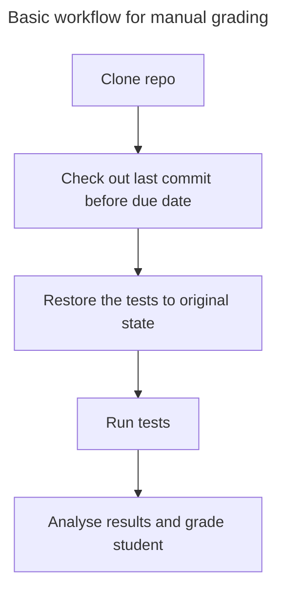

# Stuff

[Use Classroom with GitHub CLI](https://docs.github.com/en/education/manage-coursework-with-github-classroom/teach-with-github-classroom/using-github-classroom-with-github-cli)

Install extension:

    gh extension install github/gh-classroom

# Thoughts

Ideas and thoughts regarding the domain.

## Process

## Overview

- Students can submit assignments via GitHub.
- Students have names, email addresses and GitHub accounts.
- Assignments have a due date.
- Assignments are based on a template repo (starter code) with tests.
